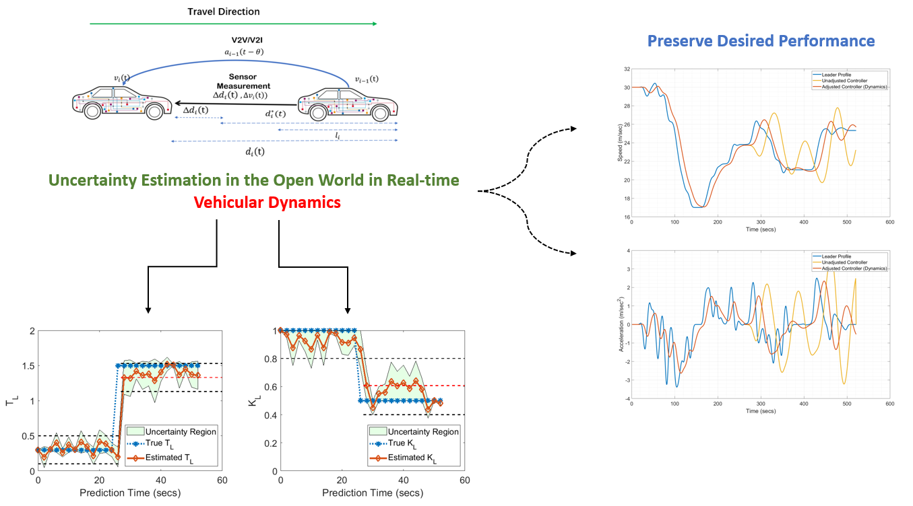
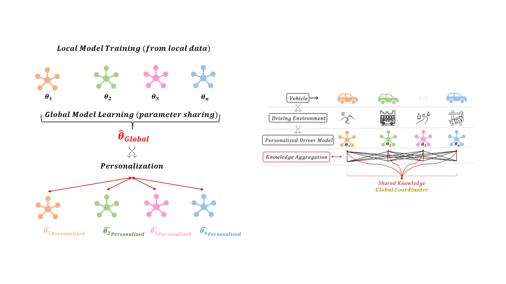
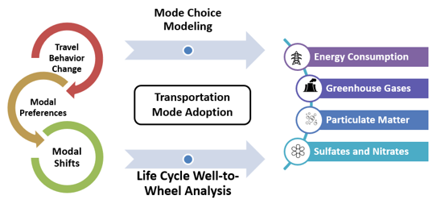

  I am on the academic job market this year.  

 Currently, I am a Postdoctoral Research Associate at the University of Wisconsin-Madison. Before that I earned my Ph.D. in Civil and Environmental Engineering from the University of Wisconsin-Madison, co-advised by <a href="https://directory.engr.wisc.edu/cee/Faculty/Ahn_Soyoung/" target=_blank> Prof. Soyoung Ahn </a> and <a href="https://directory.engr.wisc.edu/cee/Faculty/Hicks_Andrea/" target=_blank> Prof. Andrea Hicks </a>. Previously, I received my B.E. from the American University of Beirut, in my home country of Lebanon. 

 My research is on the foundations of learning, control, and analysis of emerging transportation technologies. The goal of my research is to solve challanges arising from the complexity of the new transportation ecosystem, characterized by: (i) emergence of new modes of travel, (ii) complex operations and system management, (iii) increased ability for data collection, processing, and sharing, and (iv) unique travel behaviors. To solve these challange my research draws from control theory, machine learning, cognitive engineering, life cycle assessment, and transportation science. 

 Originally I am from the mountainous village "Aabey" in Lebanon. I grew up strolling narrow streets, flaneuring mountain woods, and preserving Mediterranean architecture. 

Some of What I Have Worked On: 
======
1. <b> Autonomous vehicles </b>: <a href="https://www.sciencedirect.com/science/article/pii/S0968090X21001844"> Domain-guided control </a>; <a href="https://papers.ssrn.com/sol3/papers.cfm?abstract_id=4370172"> Open world reliability </a>; <a href="https://arxiv.org/abs/2308.16870"> Knowledge sharing and personalization </a>; <a href="https://ieeexplore.ieee.org/abstract/document/9611259"> Federated analytics for smart transportation </a>.
2. <b> Transportation sustainability </b>: <a href="https://iopscience.iop.org/article/10.1088/1748-9326/abf6f4/meta"> Autonomous vehicles adoption patterns </a>; <a href="https://iopscience.iop.org/article/10.1088/2634-4505/ac7c8b/meta"> E-bikes sharing programs</a>; <a href="https://sites.google.com/view/cheeseburgercalculator/home"> Transportation emissions calculator software </a>; <a href="https://iopscience.iop.org/article/10.1088/2634-4505/ac9a68/meta"> Emissions during pandemic </a>.

Problems I am Currently Working On:  
======
1. <b> Explainable and reliable AI for transportation </b>: End-to-end learning has shown promise in many applications across the transportation domain. I am currently exploring the intersection between physics-based models and AI end-to-end learning. The central question is "how, when, where, and to what extent" AI or physics should be employed for specific transportation operations. 
2. <b> Collaborative and distributed real-time learning for Autonomous vehicles </b>: I am developing distirbuted algorithms that enable communication pathways between vehicles, infrastructure, and intelligent transportation systems. Data exchanged through these channels are used to learn individual-level operations and optimize global objectives. See our recent preprint on this: <a href="https://arxiv.org/abs/2308.16870"> Learning Driver Models for AVs via Knowledge Sharing and Personalization </a>. 
3. <b> Competition between modes of transportation and resultant environmental impacts </b>: I am working on modeling the compeition between traiditonal modes of transportation, micro-mobility, and transit systems. I use a life cycle assessment approach to link modal competition to underlying environmental implications. See our recent <a href="https://sites.google.com/view/cheeseburgercalculator/home"> Transportation emissions calculator software </a>.

Research Spotlight
======

<b> Domain and Physics Guided Control for Autonomous Vehicles </b>

<h3> I. From Control Algorithm to Traffic Dynamics <a href="https://www.sciencedirect.com/science/article/pii/S0968090X21001844"> [Paper Link] </a></h3>

  

 AVs are typically designed with a focus on individual vehicle performance, and little attention to traffic behavior in terms of stability and efficiency. In this work, we formulate an intuitive physics-based response function that is capable of translating AV control algorithm and parameters into traffic-level dynamics. Allowing us to specify the control design of an AV in wats that consider traffic-level performance. 

<h3> II. Expected Performance vs. Real-world Performance: Addressing Real-world Uncertainties <a href="https://arxiv.org/abs/2210.13683"> [Paper Link] </a> </h3>

  

 In the real-world AVs operate under complex environments where they are expected to be exposed to exogenous and endogenous uncertainties. A major challange lies in the complexity of integrating these uncertainties into the control system and the design of the AV as it is often hard to formulate an analytical representation of them. Tn this work, we propose a methodology to estimate uncertainties in AV's driver model - specifically those related to vehicular dynamics - and preserve a desired performance from the AV against real-world uncertainties that are unaccounted for. Our methodology uses three sequential components: (i) Stochastic Gradient Langevin Dynamics (SGLD) is used to estimate parameter uncertainty in real-time relying only on AV onboard sensor data, (ii) dynamic monitoring of the driver model performance (stability, safety, and traffic implications), and (iii) strategic actions for adjustments in driver model if anomaly is detected. 

<b> Autonomous Vehicles Personalization and Collaborative Learning </b> 

  

 In this work, we present a training framework for learning AVs driver models via knowledge sharing between different vehicles and personalization. In our collaborative scheme, vehicles borrow strength from each others while retaining a personalized model tailored to the vehicle's unique properties and conditions. We adopt a federated learning algorithm that circumvents the need to share raw data between vehicle. 

 This approach allows to train safer and more reliable AVs, while retaining a desired personalized behavior for each unique vehicle. Read more about out work here <a href="https://arxiv.org/abs/2210.13683"> [Paper Link] </a> 

<b> Emerging Modes of Transportation: Adoption Patterns and Environmental Implications </b>

<h3> I. Autonomous Vehicle Adoption and Environmental Implications <a href="https://iopscience.iop.org/article/10.1088/1748-9326/abf6f4/meta"> [Paper Link] </a></h3>

  

 

<h3> II. E-bikes Adoption and Environmental Implications <a href="https://iopscience.iop.org/article/10.1088/2634-4505/ac7c8b/meta"> [Paper Link] </a></h3>

  

&nbsp;

Recent News
======

*  Recent  05/2023: Presented at the [Next-Generation Transport Systems Conference](https://www.ngts2023.nextrans.org/) at Purdue. [[Slides](..\files\NGTS_3_Talk.pdf)]

*  Recent  03/2023: We have launched our choice-experiment survey to analyze the environmental rebound effect of Automated Vehicle ridesharing. 

*  Recent  01/2023: Our [Transportation Mode Emissions calculator](https://www.calconic.com/calculator-widgets/transportation-mode-emissions-calculator-c02e/63c48b9a20c258001f9bfe22?layouts=true) is now live. This is part of an ongoing research on the environmental footprint of travel. 

*  Recent  12/2022: You can now checkout the pre-print of our paper ["Bayesian Methods in Automated Vehicle's Car-following Uncertainties: Enabling Strategic Decision Making"](https://arxiv.org/abs/2210.13683)

*  Recent  11/2022: My Ph.D. dissertation in available online ["Multi-Class Automated Vehicles: Connecting Control Dynamics to Traffic Level Understanding and Enabling Strategic Decision-Making"](https://www.proquest.com/pqdtglobal/docview/2737490814/AA10F2DD3BAC463DPQ/1?accountid=465)

*  Recent  07/2022: I was named a [Rising Star in Cyber-Physical Systems](https://risingstars.linklab.virginia.edu/2022/participants/wissam-kontar/) for my work on "Enabling System Level Functionality for Autonomous Vehicles". 

<button onclick="window.location.href='https://wissamkontar.github.io/news/';">Read more</button>
