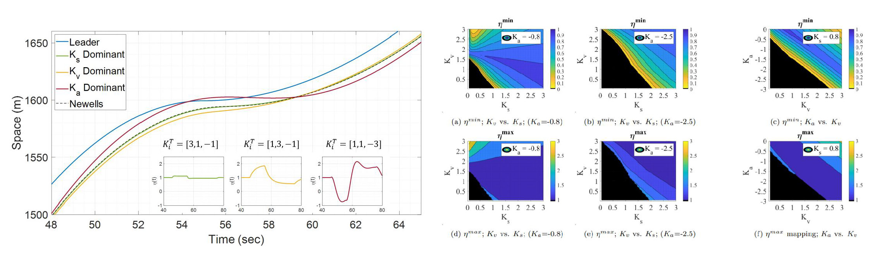

I am researcher working on developing emerging transportation technologies. My goal is to steer the development and deployment of transportation technologies to serve the need for safe, sustainable, multicephalous, and accessible mobility. 

Originally I am from the mountainous village "Aabey" in Lebanon. I grew up strolling narrow streets, flaneuring mountain woods, and preserving Mediterranean architecture. 

 Research interests : Transportation analytics & simulation; Traffic flow theory; Microscopic driving behavior modeling; Bayesian methods; Federated analytics; Enviornmental modeling

 Technology : Connected and automated vehicle design; Internet of Federated Things (IoFT); Intelligent transportation systems; Energy & emission profiling

Recent News
======
*  Recent  01/2023: Our [Transportation Mode Emissions calculator](https://www.calconic.com/calculator-widgets/transportation-mode-emissions-calculator-c02e/63c48b9a20c258001f9bfe22?layouts=true) is now live. This is part of an ongoing research on the environmental footprint of travel. 

*  Recent  12/2022: You can now checkout the pre-print of our paper ["Bayesian Methods in Automated Vehicle's Car-following Uncertainties: Enabling Strategic Decision Making"](https://arxiv.org/abs/2210.13683)

*  Recent  11/2022: My Ph.D. dissertation in available online ["Multi-Class Automated Vehicles: Connecting Control Dynamics to Traffic Level Understanding and Enabling Strategic Decision-Making"](https://www.proquest.com/pqdtglobal/docview/2737490814/AA10F2DD3BAC463DPQ/1?accountid=465)

*  Recent  07/2022: I was named a [Rising Star in Cyber-Physical Systems](https://risingstars.linklab.virginia.edu/2022/participants/wissam-kontar/) for my work on "Enabling System Level Functionality for Autonomous Vehicles". 

<button onclick="window.location.href='https://wissamkontar.github.io/news/';">Read more</button>

&nbsp;

Research Spotlight
======

<b>The New Transportation and Traffic Systems: How to Design Automated Vehicles </b>

<h3> A) From Control Structure to System Impacts </h3>

  

<h3> B) Expected Performance vs. Real-world Performance </h3>

  

<b>Emerging Modes of Transportation: Adoption Patterns and Environmental Implications </b>

  

<b>Federated Analytics for Intelligent Transportation Systems </b>

