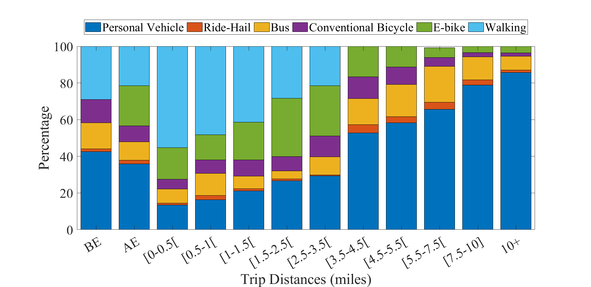

  I am on the academic job market for 2023-2024. Looking for tenure-track positions. 

 Currently, I am a Postdoctoral Research Associate at the University of Wisconsin-Madison. In August 2022 I earned my Ph.D. in Civil and Environmental Engineering from the University of Wisconsin-Madison, co-advised by <a href="https://directory.engr.wisc.edu/cee/Faculty/Ahn_Soyoung/" target=_blank> Prof. Soyoung Ahn </a> and <a href="https://directory.engr.wisc.edu/cee/Faculty/Hicks_Andrea/" target=_blank> Prof. Andrea Hicks </a>. Previously, I received my B.E. from the American University of Beirut, in my home country of Lebanon. 

 I specialize in the operational analysis and sustainability implications of emerging technologies -- with a specific focus on transportation. My research lies in various aspects of learning, analysis, and control of emerging technologies particularly addressing challenges posed by automation, connectivity, and complex behavior within their adoption ecosystem. To solve these challenges, my work draws from <b>engineering domain knowledge</b>, <b>machine learning</b>, <b>industrial ecology</b>, <b>life cycle assessment</b>, <b>cognitive engineering</b>, and <b>control theory</b>. The ultimate goal of my work is to develop methods for designing and deploying technology that is operationally beneficial and achieves sustainability in its various paradigms: environment, economy, and society. 

 Originally I am from the mountainous village "Aabey" in Lebanon. I grew up strolling narrow streets, climbing mountain woods, and preserving Mediterranean architecture. 

Some of What I Have Worked On 
======
1. <b> Autonomous vehicles </b>: <a href="https://www.sciencedirect.com/science/article/pii/S0968090X21001844"> Domain-guided control </a>; <a href="https://papers.ssrn.com/sol3/papers.cfm?abstract_id=4370172"> Open world reliability </a>; <a href="https://arxiv.org/abs/2308.16870"> Knowledge sharing and personalization </a>; <a href="https://ieeexplore.ieee.org/abstract/document/9611259"> Federated analytics for smart transportation </a>.
2. <b> Sustainability </b>: <a href="https://iopscience.iop.org/article/10.1088/1748-9326/abf6f4/meta"> Autonomous vehicles adoption patterns </a>; <a href="https://iopscience.iop.org/article/10.1088/2634-4505/ac7c8b/meta"> E-bikes sharing programs</a>; <a href="https://sites.google.com/view/cheeseburgercalculator/home"> Transportation emissions calculator software </a>; <a href="https://iopscience.iop.org/article/10.1088/2634-4505/ac9a68/meta"> Emissions during pandemic </a>.

Problems I am Currently Working On  
======
1. <b> Cyber-physical sustainable systems </b>: Modern engineering systems and technologies have unprecedented levels of computational prowess and capabilities for real-time sensing, processing, and data exchange. My current research focuses on harnessing this computational potential to enhance the efforts of sustainability in the real-world. Specifically, I aim developing distributed algorithms that enable communication pathways between agents, infrastructure, and humans. The data exchanged through these channels will be used to learn both local and global models. Local modes cater to individual-level operations, while global models align with broader objectives, such as reducing the energy cost of operation. I have started with this approach in my recent work in <a href="https://arxiv.org/abs/2308.16870"> Knowledge sharing and personalization </a>. 

2. <b> Explainable and reliable AI for engineering systems </b>: 
In various engineering domains, there has been a recent noticeable shift towards adopting end-to-end learning, where machine learning models rely solely on input data without the need for intermediate steps. For example, in transportation, these intermediaries have traditionally involved using physics-based models. I foresee that effectively applying end-to-end learning necessitates a thoughtful integration of domain expertise. To address this, I have initiated a study to explore the intersection between physics-based models and artificial intelligence, particularly in the context of dynamic systems. The central question is "how, when, where, and to what extent" AI or physics should be employed for specific operations.

3. <b> Sustainable transportation </b>: I am working on the multifaceted challenge of transportation sustainability that spans various aspects of energy generation, electrification, modal shifts, human behavior, and urban design. I am modeling the competition between traditional modes of transportation, micro-mobility, and transit systems. Allowing us to design transport networks that accommodate diverse and competing modes effectively. Simultaneously, I am working on reducing transportation emissions in a fair and equitable manner. See our latest <a href="https://sites.google.com/view/cheeseburgercalculator/home"> Transportation emissions calculator software </a>.

Research Spotlight
======

<b> Domain and Physics Guided Control for Autonomous Vehicles </b>

<h3> I. From Control Algorithm to Traffic Dynamics <a href="https://www.sciencedirect.com/science/article/pii/S0968090X21001844"> [Paper Link] </a></h3>

  

 AVs are typically designed with a focus on individual vehicle performance, and little attention to traffic behavior in terms of stability and efficiency. In this work, we formulate an intuitive physics-based response function that is capable of translating AV control algorithm and parameters into traffic-level dynamics. Allowing us to specify the control design of an AV in wats that consider traffic-level performance. 

<h3> II. Expected Performance vs. Real-world Performance: Addressing Real-world Uncertainties <a href="https://arxiv.org/abs/2210.13683"> [Paper Link] </a> </h3>

  

 In the real-world AVs operate under complex environments where they are expected to be exposed to exogenous and endogenous uncertainties. A major challenge lies in the complexity of integrating these uncertainties into the control system and the design of the AV as it is often hard to formulate an analytical representation of them. Tn this work, we propose a methodology to estimate uncertainties in AV's driver model - specifically those related to vehicular dynamics - and preserve a desired performance from the AV against real-world uncertainties that are unaccounted for. Our methodology uses three sequential components: (i) Stochastic Gradient Langevin Dynamics (SGLD) is used to estimate parameter uncertainty in real-time relying only on AV onboard sensor data, (ii) dynamic monitoring of the driver model performance (stability, safety, and traffic implications), and (iii) strategic actions for adjustments in driver model if anomaly is detected. 

<b> Autonomous Vehicles Personalization and Collaborative Learning </b> 

  

 In this work, we present a training framework for learning AVs driver models via knowledge sharing between different vehicles and personalization. In our collaborative scheme, vehicles borrow strength from each others while retaining a personalized model tailored to the vehicle's unique properties and conditions. We adopt a federated learning algorithm that circumvents the need to share raw data between vehicle. 

 This approach allows to train safer and more reliable AVs, while retaining a desired personalized behavior for each unique vehicle. Read more about out work here <a href="https://arxiv.org/abs/2210.13683"> [Paper Link] </a> 

<b> Emerging Modes of Transportation: Adoption Patterns and Environmental Implications </b>

<h3> I. Autonomous Vehicle Adoption and Environmental Implications <a href="https://iopscience.iop.org/article/10.1088/1748-9326/abf6f4/meta"> [Paper Link] </a></h3>

  

 The adoption of Autonomous Vehicles as a viable mode of transportation comes with an complex web of modal shifts and travel behavior. We find that this technology enjoys a level of attractiveness by different users that can induce a modal shift away from traditional modes of transportation as transit, or personal vehicles. This translates to an increase in environmental impacts across different categories: energy consumption, greenhouse gas emissions, particulate matter, sulfur and nitrogen oxides. 

 Adopting electric autonomous vehicles can offset the increase in emissions however it is dependent on two main factors: (i) adoption rate, and (ii) electricity generation mix. 

<h3> II. E-bikes Adoption and Environmental Implications <a href="https://iopscience.iop.org/article/10.1088/2634-4505/ac7c8b/meta"> [Paper Link] </a></h3>

  

 We analyze the ability of an E-bike sharing program in reducing environmental emissions of the transportation system. Based on a mode choice model informed from revealed and stated preference survey, we show that E-bikes are able to compete for ridership. Specifically, E-bikes can attract users away from personal vehicles in trip distances between 1-2.5 miles, resulting in a reduction in overall emissions. 

 

Recent News
======
*  Recent  October, 2023: I will be giving a lectern presentation in the upcoming 103rd Transportation Research Board Annual Meeting in Washington, DC. 
*  Recent  October, 2023: I am on the academic job market
*  Recent  October, 2023: I gave a lightning talk during the Sustainability Symposium at the University of Wisconsin-Madison titled "The Road to Efficient and Sustainable Transportation"
*  Recent  October, 2023: I presented at the Future Faculty Symposium during the Society of Engineering Science Annual Meeting
*  Recent  September, 2023: I gave a talk on "Transportation Innovation for Societal Benefits: Complexities and Opportunities" at the Annual Postdoctoral Research Symposium at University of Wisconsin-Madison
*  Recent  September, 2023: My paper on <a href="https://arxiv.org/abs/2308.16870"> Learning Driver Models for Automated Vehicles via Knowledge Sharing and Personalization </a> was accepted for presentation at TRB 2024
*  Recent  June, 2023: Invited for an oral presentation at the 11th International Conference on Industrial Ecology in Leiden, Netherlands
*  Recent  May, 2023: Presented at the [Next-Generation Transport Systems Conference](https://www.ngts2023.nextrans.org/) at Purdue University
*  Recent  April, 2023: We have launched our choice-experiment survey to analyze the environmental rebound effect of Automated Vehicle ridesharing 
*  Recent  January, 2023: Our [Transportation Mode Emissions Calculator](https://www.calconic.com/calculator-widgets/transportation-mode-emissions-calculator-c02e/63c48b9a20c258001f9bfe22?layouts=true) is now live
*  Recent  November, 2022: My Ph.D. dissertation in available online ["Multi-Class Automated Vehicles: Connecting Control Dynamics to Traffic Level Understanding and Enabling Strategic Decision-Making"](https://www.proquest.com/pqdtglobal/docview/2737490814/AA10F2DD3BAC463DPQ/1?accountid=465)
*  Recent  May, 2022: I was named a [Rising Star in Cyber-Physical Systems](https://risingstars.linklab.virginia.edu/2022/participants/wissam-kontar/) for my work on "Enabling System Level Functionality for Autonomous Vehicles"

<button onclick="window.location.href='https://wissamkontar.github.io/news/';">Read more</button>
